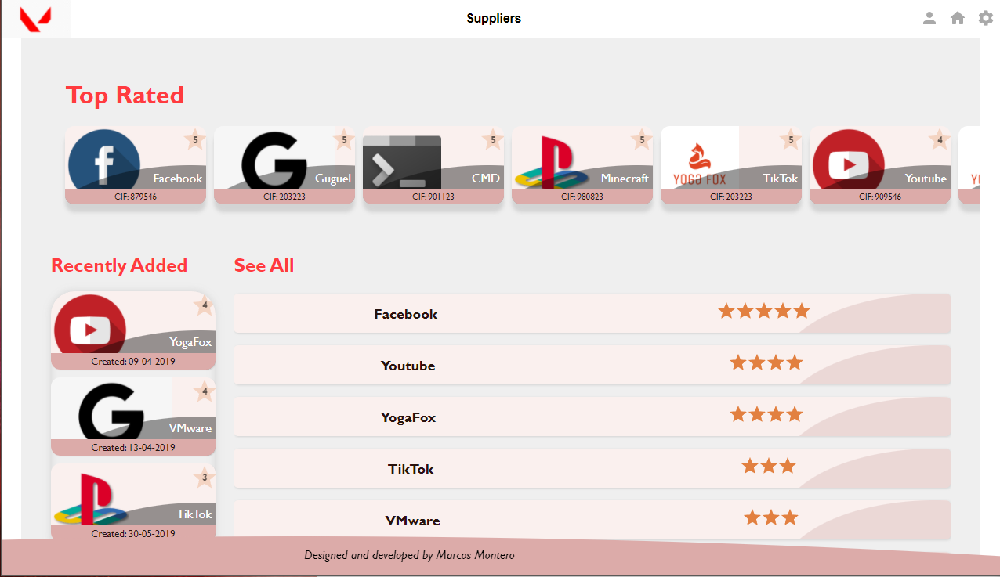
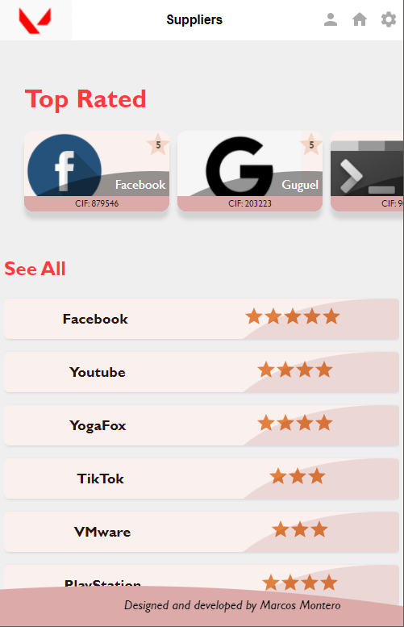
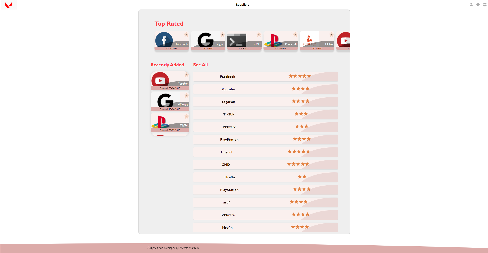

# Supplier list project for a bank service



---

## Índice<a name="indice"></a>

- [Supplier list project for a bank service](#supplier-list-project-for-a-bank-service)
  - [Índice<a name="indice"></a>](#índice)
  - [Instalación](#instalación)
    - [Repositorios](#repositorios)
    - [Base de Datos<a name="basededatos"></a>](#base-de-datos)
    - [Colección Postman<a name="postman"></a>](#colección-postman)
    - [Levantar el Proyecto<a name="levantar"></a>](#levantar-el-proyecto)
  - [Info del Proyecto<a name="info"></a>](#info-del-proyecto)
    - [Backend<a name="backend"></a>](#backend)
    - [Frontend<a name="frontend"></a>](#frontend)
      - [Estructura](#estructura)
      - [User Experience](#user-experience)
      - [Componentes Reutilizables](#componentes-reutilizables)
      - [Responsive Design](#responsive-design)
      - [Typescript ESLint Prettier](#typescript-eslint-prettier)
      - [Librerías de estilo: Styled Components y Framer-motion](#librerías-de-estilo-styled-components-y-framer-motion)
  - [Anexo: dependencias destacadas](#anexo-dependencias-destacadas)

---

## Instalación

### Repositorios

Para la instalación del proyecto completo es necesario descargar 2 repositorios, para back y para front:

```sh
    git clone https://github.com/MarcosMRod/prueba_tecnica_backend.git
```

```sh
    git clone https://github.com/MarcosMRod/prueba_tecnica_frontend.git
```

### Base de Datos<a name="basededatos"></a>

En el repositorio backend se encuentra el 'script.sql' que consiste en un Mock de proveedores. Se trata de una tabla Suppliers con unos pocos registros.

Se ha de importar en MySQL WorkBench, dentro de una conexión localhost:3306, con **usuario 'root'** y **contraseña 'springroot'**. Por la rapidez del proyecto, no se han testeado distintas maneras de importación de la base de datos. Si no consiguiera conectar la base de datos contácteme y estaré encantado de ayudar.

### Colección Postman<a name="postman"></a>

La colección postman consta de dos peticiones get que sirven el listado de provedores entero para una primera carga y el detalle de datos de un proveedor en concreto en función de su id. Ambas peticiones tienen incorporada la utorización de usuario y contraseña mencionadas.

### Levantar el Proyecto<a name="levantar"></a>

Levantar backend:
- Una vez configurada la base de datos, levantar backend. En la raíz de la carpeta back:
  ```sh
  npm i
  ```
- Comprobar que las peticiones postman funcionen correctamente. Si no, algo falla en la configuración de la base de datos. Contactadme.
- En la raíz de la carpeta front
  ```sh
  npm i
  ```
  ```sh
  npm start
  ```
- A valorar Suppliers!
## Info del Proyecto<a name="info"></a>

### Backend<a name="backend"></a>

Tratándose de una prueba técnica de frontend, el backend ha sido tratado con menor prioridad, por lo que está basado en spring-boot y el controlador, modelo, respositorio y servicio de los Suppliers. De esta manera se ha construido una API mínima para el acceso la base de datos a través de **localhost:3306/supplier** y **localhost:3306/supplier/{id}**

### Frontend<a name="frontend"></a>

#### Estructura

```
.
├── src
│   └── api
│   └── components
│   └── img
│   └── layout
│   └── theme
```

#### User Experience

Como desarrollador frontend, me gusta trabajar muy acompasado con los diseñadores de UX. Siempre doy gran importancia a la experiencia de usuario en mis proyectos y procuro que cada nuevo desarrollo nazca desde el primer momento orientado al uso que los usuarios vayan a hacer de él.

En este proyecto he hecho especial esfuerzo en la materialización de los Suppliers:

- El usuario los ha de agarrar para hacer scroll entre ellos. Además el movimiento de **scroll con físicas naturalizadas** gracias a la librería
- **Diseño de cartas** para cada supplier. La materialización de los Suppliers, como ya es sabido, pasa por ponerles un box-shadow y un border
- **Reactivo al hover y al click**
- Footer Informal y dinámico: El footer rompe con la estética de la app, quedando como el sello de que se trata de una app demo y revelando al desplegarse un link a github

#### Componentes Reutilizables

Todos los componentes han sido desarrollados como Functional Components, procurando mantener el paradigma de minimizar las props de estos, para su mayor escalabilidad y reutilización.

Han sido divididos en 'components' todos los componentes susceptibles de ser reutilizados y en 'layout' aquellos que dan forma a la app.

#### Responsive Design

La experiencia de usuario no podría ser óptima si el diseño no se adecuara a su dispositivo por lo que se han tomado las siguientes decisiones en función del dispositivo:

- Mobile: Se minimiza información, centrando el foco en el listado de los proveedores mejor valorados y la vista global. El contenido llena la pantalla y no hay fondo.

  
  
- Tablet: Se añade sección 'recently added' y un margen de 1% en los laterales para la mejorar la percepción de verticalidad, enseñando por primera vez el fondo de la app.

  
  
- Desktop >2k: se encapsula el contenido en una caja central, permitiendo ensanchar los bordes laterales sin afectar al diseño principal del contenido, solo afectando al nav, footer y el fondo blanco.

  

#### Typescript, ESLint, Prettier

Todo el proyecto ha sido debidamente tipado con typescript y formateado con Prettier en base a reglas de ESLint.

#### Librerías de estilo: Styled Components y Framer-motion

Para todo el diseño de estilos se ha utilizado Styled Components así como su filosofía de encapsular en cada componente su estilo correspondiente. Además, se ha combinado con los componentes UX-friendly de framer-motion, que añaden funcionalidades muy interesantes de cara a la UX.

La sintaxis para combinar estas librerías resulta un poco confusa, pero básicamente pasa por pasar el objeto de framer motion utilizado como argumento de la función styled y añadirle como tag literal los estilos css. De este modo se pueden pasar al componente props que vayan a ser utilizadas por el css de styled(prop 'color' en el ejemplo abajo), a la vez que las props que nos habilitan los objetos de framer-motion(prop 'whileHover' en el ejemplo abajo).

```js
import styled from "styled-components";
import motion from "framer-motion";

const divStyled =
  styled(motion.div) <
  tipado >
  `
  color: ${(props) => props.color}
`;
export const Componente = () => (
  <divStyled color={"magenta"} whileHover={{ scale: 1.1 }}></divStyled>
);
```

## Anexo: dependencias destacadas

-  17.0.2
-  5.3.3
-  5.4.2
-  6.2.6
-  14.18.0
